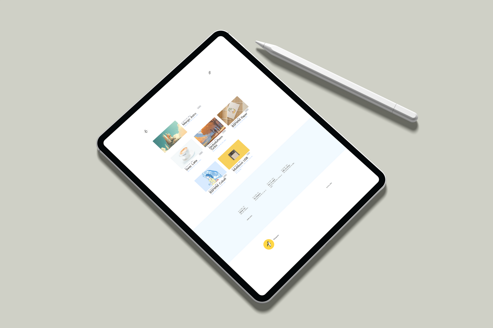
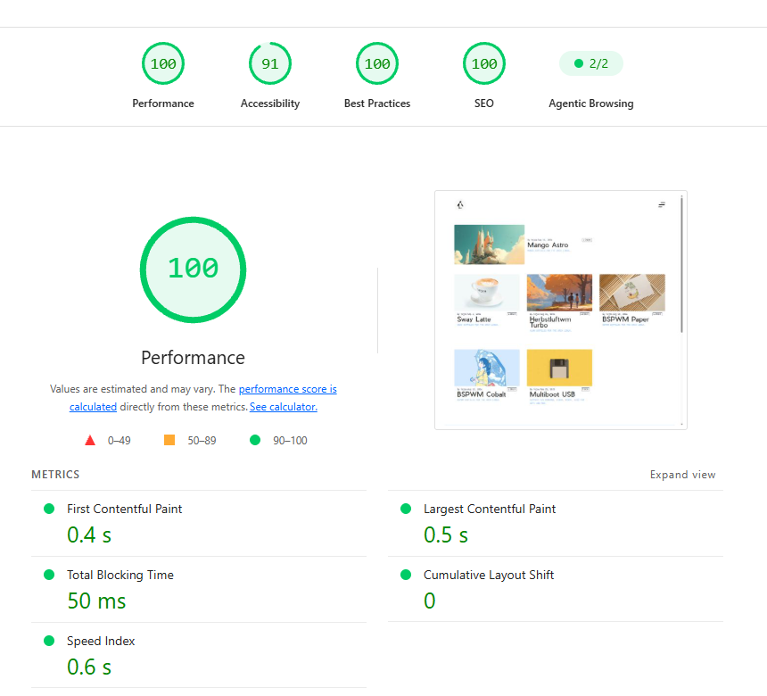

   

> [!NOTE]
> Features 🧼   

- Blog about   
    - Tech 
    - Linux
    - Life Style  
- Clean UI   
- Fast   
- Optimized   
- SEO-Friendly   
- Responsive Design   
- Cloud & Vercel Hosting Ready

#### Tech Stack
```
Astro | Bun | Vite | Biome | Tailwind CSS | TypeScript
```   

   

## Project Structure

```text
Directory structure:
└── pinux/
    ├── astro.config.mjs
    ├── biome.json
    ├── bun.lock
    ├── package.json
    ├── preview/
    │   ├── 1.png
    │   ├── 2.png
    │   ├── 100.png
    │   ├── pinux_1.png
    │   └── pinux_2.png
    ├── public/
    │   ├── android-chrome-192x192.png
    │   ├── android-chrome-512x512.png
    │   ├── apple-touch-icon.png
    │   ├── favicon.ico
    │   ├── favicon.svg
    │   ├── images/
    │   │   ├── logo.png
    │   │   └── logo_2.png
    │   ├── manifest.webmanifest
    │   ├── og.png
    │   └── robots.txt
    ├── README.md
    ├── src/
    │   ├── assets/
    │   │   ├── fonts/
    │   │   │   ├── JetBrainsMono-VariableFont_wght.woff2
    │   │   │   ├── PierSans-Bold.woff2
    │   │   │   ├── PierSans-Light.woff2
    │   │   │   └── PierSans-Regular.woff2
    │   │   └── team/
    │   │       ├── alex.png
    │   │       ├── yojee.png
    │   │       └── yura.png
    │   ├── components/
    │   │   ├── Badge.astro
    │   │   ├── BaseHead.astro
    │   │   ├── BlogCategories.astro
    │   │   ├── BlogListing.astro
    │   │   ├── BlogNotesList.astro
    │   │   ├── BlogPostCard.astro
    │   │   ├── Button.astro
    │   │   ├── Footer.astro
    │   │   ├── Header.astro
    │   │   ├── Icon.astro
    │   │   ├── JsonLd.astro
    │   │   ├── NavLink.astro
    │   │   ├── Pagination.astro
    │   │   ├── PostListItem.astro
    │   │   ├── Prose.astro
    │   │   ├── SmoothScroll.astro
    │   │   ├── SocialLink.astro
    │   │   ├── TeamList.astro
    │   │   ├── ThemeToggle.astro
    │   │   ├── TOC.astro
    │   │   ├── TOCHeading.astro
    │   │   └── TOCList.astro
    │   ├── content/
    │   │   ├── blog/
    │   │   │   
    │   │   └── pages/
    │   │       ├── about.mdx
    │   │       ├── tags.mdx
    │   │       └── team.mdx
    │   ├── content.config.ts
    │   ├── data/
    │   │   ├── site-config.ts
    │   │   └── types.ts
    │   ├── layouts/
    │   │   └── BaseLayout.astro
    │   ├── lib/
    │   │   └── utils.ts
    │   ├── pages/
    │   │   ├── 404.astro
    │   │   ├── blog/
    │   │   │   ├── [...page].astro
    │   │   │   └── [id].astro
    │   │   ├── index.astro
    │   │   ├── og/
    │   │   │   └── [...id].ts
    │   │   ├── rss.xml.js
    │   │   ├── tags/
    │   │   │   ├── index.astro
    │   │   │   └── [id]/
    │   │   │       └── [...page].astro
    │   │   └── [...id].astro
    │   ├── styles/
    │   │   └── global.css
    │   └── utils/
    │       ├── common-utils.ts
    │       ├── data-utils.ts
    │       ├── schema-utils.ts
    │       └── toc-utils.ts
    └── tsconfig.json

## Commands

All commands are run from the root of the project:

| Command           | Action                                          |
| :---------------- | :---------------------------------------------- |
| `bun install`     | Installs dependencies                           |
| `bun run dev`     | Starts local dev server at `localhost:4321`     |
| `bun run build`   | Builds the production site to `./dist/`         |
| `bun run preview` | Previews the build locally                      |
| `bun run check`   | Lints + formats (Biome, applies safe fixes)     |
| `bun run ci`      | Non-mutating Biome check for CI                 |

> [!IMPORTANT]
> https://pinux.vercel.app — now using in the config files on production.
> When your project gets a different domain name (for example, new.vercel.app)    
or you connect your own domain, update all 4 locations;    
otherwise, the incorrect address will remain.   

> astro.config.mjs   
> public/robots.txt   
> site-config.ts   
> BaseLayout.astro.    